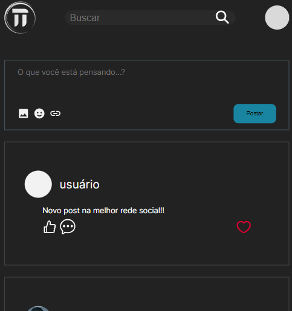
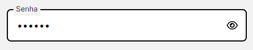
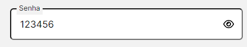

# TTwiter

Projeto feito como parte do treinamento tecnico para desenvolvedor na EJCM. A visualização da página pode ser vista no site 	&lt;nome do site no glich&gt;

## Funcionalidades
  ### Fazer novos posts
  O usuário pode digitar uma mensagem na caixa de texto e, ao clicar em "Postar" o feed é atualizado com o novo post. Atualmente, só é possível realizar postagens contendo texto, como mostrado na imagem abaixo

  
  
  ### Mostrar/esconder senha
  Ao clicar no icone de um olho, o usuário mostra ou esconde a senha digitada, conforme o exemplo abaixo

  
  

  ### Buscar Posts
  Ao digitar um texto na barra de busca, o feed é atualizado automaticamente com os posts que contenham esse texto